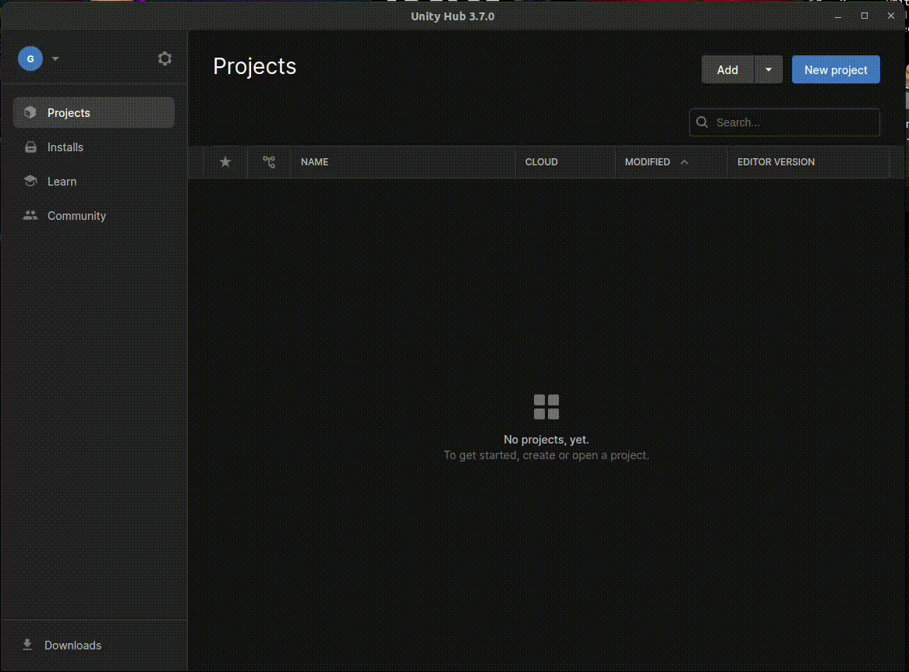
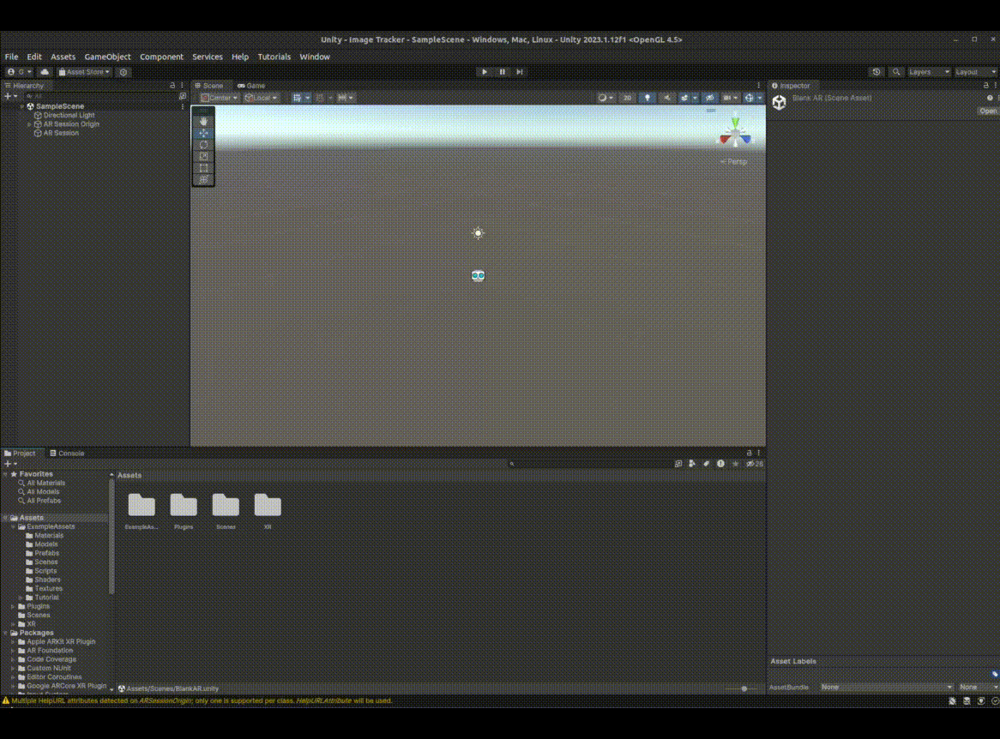
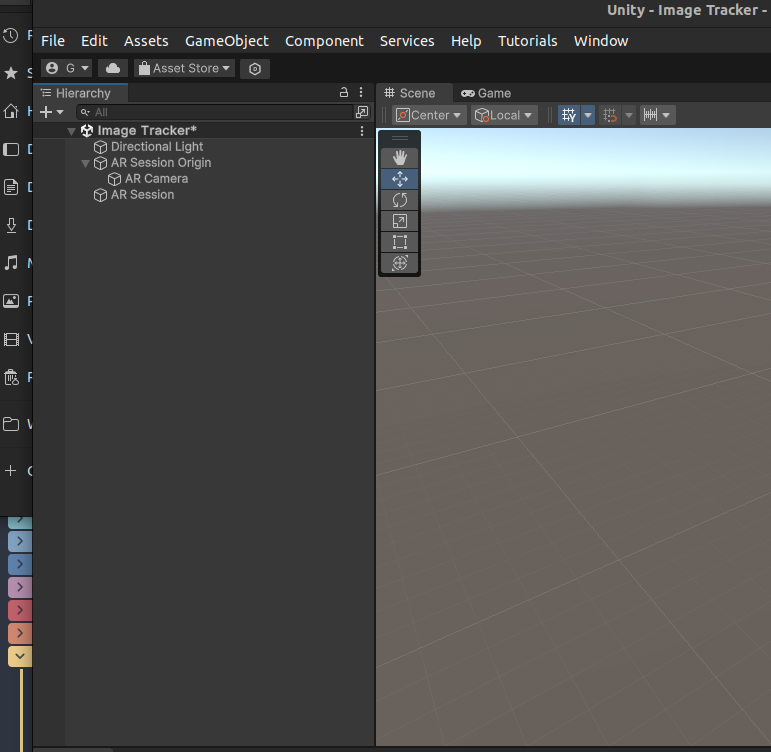
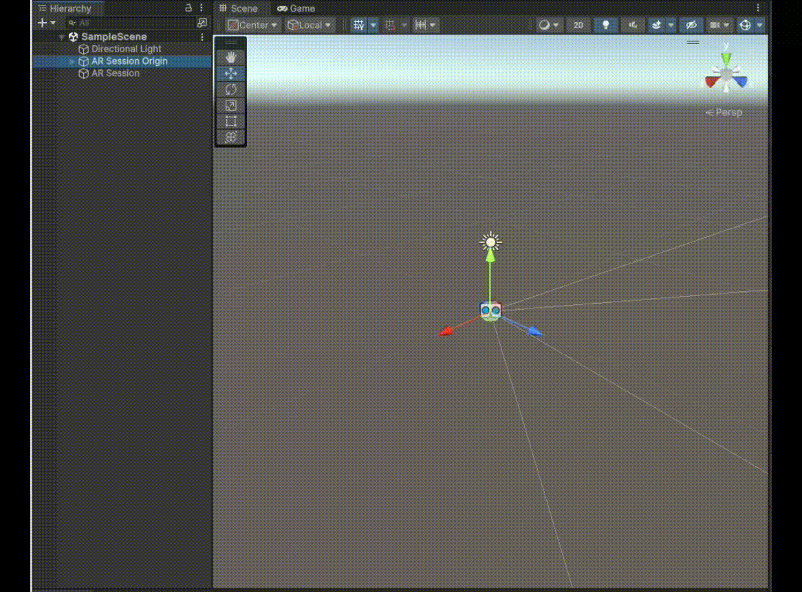
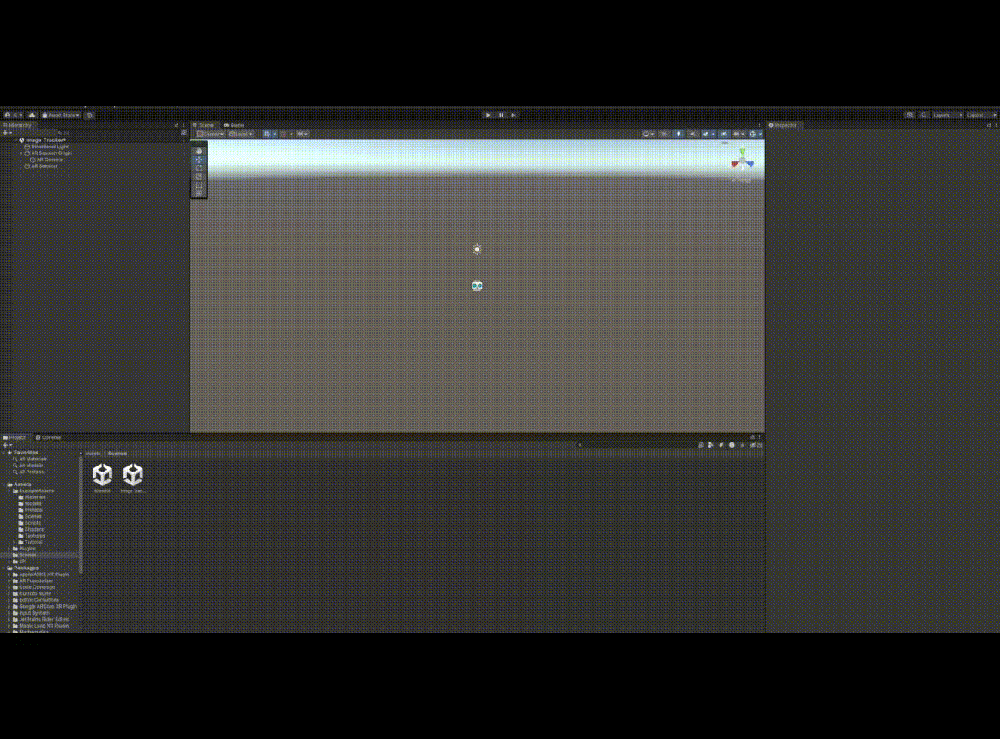
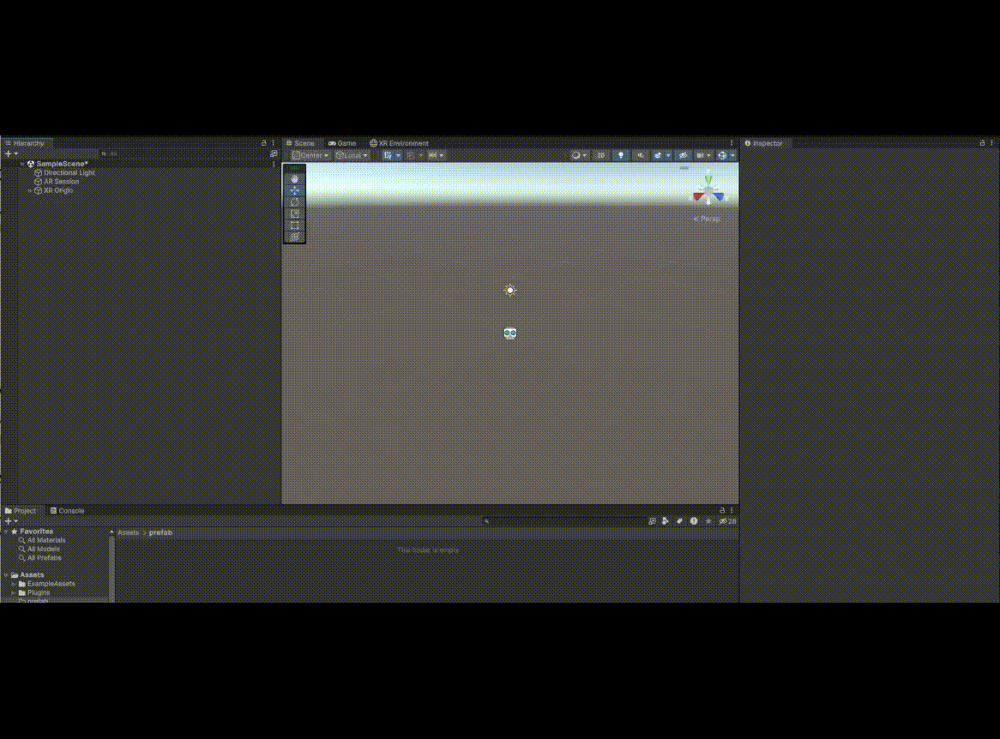
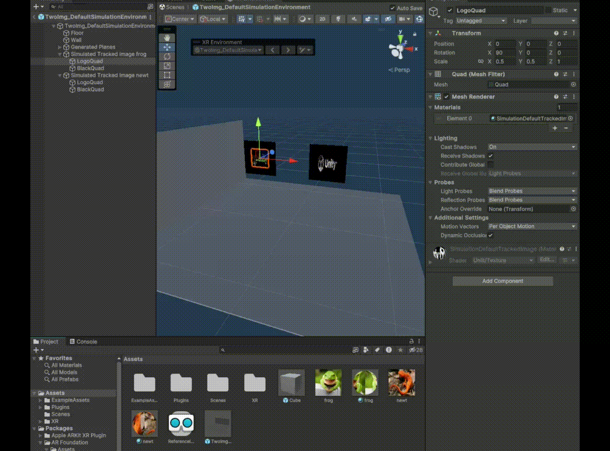
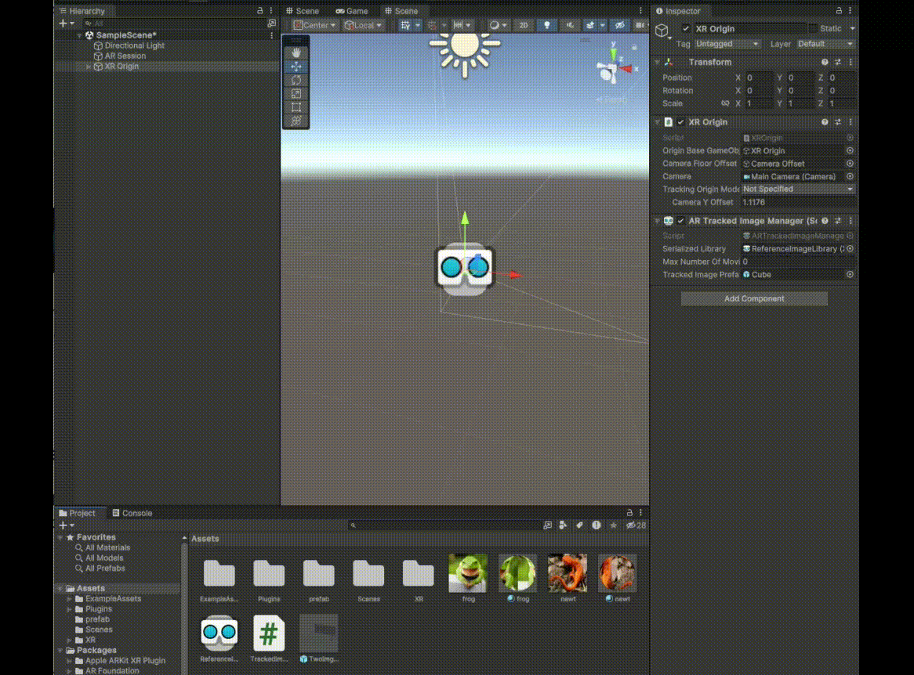

## Image tracking Tutorial

We are going to create a simple AR project in Unity which uses image tracking to place objects onto images. We will see how to:
- Create a simulator to easily debug it in the Unity Editor. 
- Have a quick look at coding a basic script that can change objects depending on the image it is tracked to. 
- Finally compile the project to test and run on a phone IRL!

### Create a new unity AR project

In unity hub create a new project by selecting the 'New Project' button. 

In the next prompt choose the AR template. Then choose a name similar to 'AR Image Tracker'. 

Then select 'Create Project', and it will initialise the project for you.


### Check Android modules are installed

Go to `File>Build Settings`

Then select android, and if it shows a `Install with Unity Hub` button click it. It will then take you to a new window where android should be selected already and you can press the `install` button.

Then back in the Unity Editor and the `Build Settings` window, select Android and press `Switch Platform`. It should take a min but will now compile to android!

### Choose your XR platform + player settings

Got to `edit>project settings`.

Then go to `XR plug-in management` in the left tab and:
- For the computer setup tick XR Simulation
 
- For Android tick Google AR Core


Then go to `Player` in the left tab and:
- Under `Android(icon) tab>Other Settings>Graphic API's`, and remove `OpenGLES2` if it is there (it wasn't on mine/img below but that's where it will be).

- Scroll further down `Other Settings` to `Package Name` under the `Identification` heading. As it says in the warning, set it to a syntax of `com.CompanyName.ProjectName` (e.g. `com.Geo.ARFun`)

- Scroll a bit further down to `Configuration` and untick `ARMv7` if it isn't already.


### Double check prefrences

Just incase double check the simulation prefrences by going to `Edit>Prefrences` and making sure `Enable Navigation` is ticked in the `XR Simulation` tab.


### Duplicate the AR project

Now in the new project go to the project window, in the bottom left, and open the scenes folder. 

Let's duplicate the 'BasicAR' scene by selecting it with the mouse and then pressing cntrl C and cntrl V.

Now rename it to something similar to ' AR Image Tracker'.



### Lets see whats in there!

If you open the new scene and look at the hierarchy it will look similar to this:


The hierarchy helps us see and understand how things are constructed in the scene. what belongs where and how things are related. You can also add elements into the scene here, or through the 3d view.

In our scene you see:
- Directional light - to add some light
- AR Session Origin - All AR events and objects happen within this. It basically moves the scene around to track it to the real world.
- AR Camera - renders the objects from the correct angle.
- AR Session - Manages the AR session for us, doing a lot of the background work.

If you click on each you will see on the right hand side that they each have scripts attached to those objects to make them do what they do. We use the default scene as this is all setup and easy to use!

### Update to XR Origin

For me at least this demo scene has an outdated `AR Session Origin` so lets update it quickly!

- Firstly delete the `AR Session Origin` by right clicking it in the hierarchy then selecting delete.
- Then right click into an empty space in the hierarchy and select `XR>XR Origin (Mobile AR)`




### Adding the AR Tracked Image Manager Component

Now we need to add the `AR Tracked Image Manager` component to our `XR Origin`. 

Firstly select the `XR Origin` if you haven't already.

Then press `Add Component` and select `AR Tracked Image Manager` Component.


#### Let's see what it is?


So this has a few inputs/options:

##### Serialized Library:
Is an file we will create holding all of our tracked images as binaries, so they run quickly. It will be covered in more depth in the next steps.


##### Tracked Image Prefab:
Is a [prefab](https://learn.unity.com/tutorial/prefabs-e) ( a set of predefined game objects) that we will create for the project. This prefab will be spawned onto the images we are tracking. 


#### Create + Add Serialized Library

##### Create a Reference Image Library:

- In the project window choose which directory you want to store it.
- Then right click there selecting create>XR>Reference Image Library.
- Rename the library if you want.
- Select the new library and see the add image button  show up on the right hand side.
- Press it and see the new menu to show up for an image. 



##### Find A Picture

Have a look online and find an image you want to try and track. It needs to be of reasonably high quality so that it has good points to track. 

I chose this one:


Then drag and drop it into the project window, maybe into a folder called images, if you want to make one. 

It should look like this:


##### Add the image to the Library

Now select the `Reference Image Library` we made earlier and then drag + drop the image into the slot we made earlier, and give it a suitable name like `frog` , so it looks like this:


Do this for a second image so it looks like this:


##### Adding Library

Now select the `XR Origin` and then either drag and drop the `ReferenceImageLibrary` we have prepared over, or select the small dot (under the mouse in the image) on the right to get this sub menu shown below.


Well done you made and added a  serialised image library to track images for us!


#### Create + Add A Prefab

Now we will create a prefab that will be the object that will appear on the image.

- Firstly right click into the hierarchy and select `3D Object > Cube` to create a new cube game object.
- Scale it to 0.1 on the X, Y and Z, as this is roughly the right scale for AR by default.
- Drag and drop the cube object into the project window, where you want to save it.



You should now have a new cube object in the project window, and the cube object in the hierarchy will have turned blue. 

#### Add the Prefab to the Tracked Image Manager

Now we need to add it to the Tracked Image Manager Component so we can see it on the images it picks up.

- Firstly Delete the blue `cube` in the hierarchy.
- Then Select the XR Origin`
- Either drag and drop the prefab cube we made from the project window to the `Tracked Image prefab` input on the `AR Tracked Image Manager`, or select the small dot on the side and choose it from the sub-menu (shown below).


### XR Test Environment

Now we can start to test this out in an xr test environment! (This makes it a lot easier than continually testing on a mobile.)

#### Open test environment
Lets open a test environment up by going to `Window(at the top menu near file/edit etc)>XR>ARFoundation>XREnvironment`. This will pop up a new window and you can drag and drop it by the tab to fit more comfortably in the unity UI.

So it looks like this:


This highlighted tab has lots of different environments to test in, and if they are not there you can install them all by going to this highlighted menu here and selecting `install sample environments`. This is an optional step as we just need the default at the moment.


#### Create our own test scene
For today though we will be duplicating the default environment. To do that select the highlighted submenu here and then select `Duplicate environment`


Then chose a name, like `TwoImg_defaultSimu . . .prefab` to save it as.


Once Saved it will open the prefab scene that we can edit and look like this.


##### Modify the test scene

We are going to be making two test images for our two images in our library. Firstly we need to modify the current image by:

- Selecting `LogoQuad`, and then in the right hand `Inspector` menu resize the scale to be `x: 0.05, y:0.5 z:1` as we need a rectangle.


- We then need to duplicate the `Simulated Tracked Image` by right clicking it and selecting `Duplicate`. Then rename them to suit the images you selected, so mine is `frog` and `newt` like below.


- Now select one of the `SimulatedTrackedImage . . .` and move it to so they are not covering each other. You can do this with the arrows in the 3D view, or the `Position` parameters in the inspector, so it looks like this:


##### Now to make the images into materials

- To add a new material right click in the project window, in the folder you want it in, then select `Create>Material`. This will then create a new material in that folder, call it something appropriate, I went with `Frog`.

**vid12**

- With the new material selected, in the `Inspector` window, use the `Shader` drop down menu (highlighted below) to select `Unlit>Texture`


- Now add an image to it by either dragging and dropping the image into the texture field, or pressing `select` to use the sub-menu.


- Now duplicate it by selecting the material in the `Project` window, and then pressing `cntrl C`, and then `cntrl V`. 
- Rename the new material to appropriate name, for me `Newt`.
- And then add the appropriate image to the new material .

It should something look like this:


##### Adding the Material to the objects

Now we can add the materials to the objects in the scene by either dragging and dropping the appropriate materiel onto the appropriate `LogoQuad`, or by selecting the `LogoQuad`, going to the `Mesh Renderer` component and setting the `Materials` element to the appropriate material (e.g. frog to frog, and newt to newt).



##### Adding the images to the tracking simulator

For the simulator to work we have to use a special script that does tagging and tracking for us. to add it in we must:
- Select the `Simulated Tracked Image . . . ` 
- In the Inspector window in the `Simulated Tracked Image` component set `Image` to the appropriate image. 


- Repeat for the other `Simulated Tracked Image . . . ` 

#### Now to test it

Pressing the `Play` button at the top will start the simulation.


Use these control to move around:
- Right-click + move mouse to look around.
- Right-click + W,A,S,D to move around.

If everything works out right you should see two cubes on the images like this:


Awesome!!!

### Now to code an interaction

When it comes to coding there are many benefits, as you can do lots of complex and custom things! C# is an easier language (similar to p5/js but also different), and the Unity docs are really helpful, so don't be too nervous about giving it a go. 

Today we will do a simple script that will change the colour of the prefab cube depending on which image it is on. If you have trouble with code, just keep going, ask for help and don't worry too much if you don't understand everything.

#### Create a Script
Firstly create a new script by:
- Right clicking in the project window
- Going to `Create>C# Script`
- Naming it something sensible like `TrackedImageColor`

- Double click it to open in an IDE (code editor). I recommend Visual Studio as it has helpful auto predict tools and is made for C#. If it doesn't open automatically select it from the menu, or ask for help as we will have to set it up in the `external tools` part of the `prefrences`.

#### A default script

When you first open it, it will probably look like this:

``` c#
using System.Collections;
using System.Collections.Generic;
using UnityEngine;

public class TrackedImageColor : MonoBehaviour

{

// Start is called before the first frame update
void Start()
{

}

  

// Update is called once per frame
void Update()
{

}

}
```

This is the default setup, and works like many scripts/coding languages you may have used. It has a:

- `using` = importing libraries 
- `public class` = creating a new class/component 
- `MonoBehaviour` = it is called once per frame
- `void Start()` = a function that is called when the script is first ran.
- `void Update()` = a function called every frame.

#### Coding for the  `AR tracked image manager`

In Unity the components we add in such as the `AR tracked image manager` can be interfaced with through code, and this is where we can do really cool things!

If you look at [AR tracked image manager docs](https://docs.unity3d.com/Packages/com.unity.xr.arfoundation@4.1/manual/tracked-image-manager.html) you will see a few different examples and we are going to be working from one today. 

This is the example they give (with comments added in by me):
``` C#
// add a field to the unity ui where you can add the 'AR Tracked Image Manager'
[SerializeField]
ARTrackedImageManager m_TrackedImageManager; 

// callbecks to listen to events and call our `OnChanged` function
void OnEnable() => m_TrackedImageManager.trackedImagesChanged += OnChanged;
void OnDisable() => m_TrackedImageManager.trackedImagesChanged -= OnChanged;

// Declaring the `OnChanged` that hands through an `ARTrackedImagesChangedEventArgs`
void OnChanged(ARTrackedImagesChangedEventArgs eventArgs)
{

	// loop over  added events
    foreach (var newImage in eventArgs.added)
    {
        // Handle added event
    }
    
	// loop over  updated events
    foreach (var updatedImage in eventArgs.updated)
    {
        // Handle updated event
    }
    
	// loop over  removed events
    foreach (var removedImage in eventArgs.removed)
    {
        // Handle removed event
    }
}
```

This example is handy as it explains how to listen out for events from the image tracked manager such as:
- added
- updated
- removed

#### Hacking it for our scene

We just want our script to color our cubes depending on the image they are tracked to, and this just needs to be called once when they appear. so we will just loop over the `added` events. 

Putting this into our existing script looks like this:
``` C#
using System.Collections;
using System.Collections.Generic;
using UnityEngine;
using UnityEngine.XR.ARFoundation; // import the XR libraries

  

public class TrackedImageColor : MonoBehaviour
{

	// add a field to the unity ui where you can add the 'XR Tracked Image Manager'
	[SerializeField]
	ARTrackedImageManager m_TrackedImageManager;
	
	// setup callbacks
	void OnEnable() => m_TrackedImageManager.trackedImagesChanged += OnChanged;
	void OnDisable() => m_TrackedImageManager.trackedImagesChanged -= OnChanged;

  

	// function called whenevr there is a change in the scene.
	
	void OnChanged(ARTrackedImagesChangedEventArgs eventArgs)
	{
		// iterate over added event changes, getting a single image change per step.
		foreach (var newImage in eventArgs.added)
		{
			// priniting out the names/tags of the images
			Debug.Log(newImage.referenceImage.name);
		}
	}

}
```

See how we have actually gotten rid of the `start` and `update` function and replace them with the callback from the example, as all we need is to do things when an image is found/object made.

#### Checking for errors

Now save the script and jump back into the Unity Editor, you will see it loads for a second, and any errors in the code will be shown in the console like this.


This error tells us there is a `;` missing. The most important thing though is the 2 numbers in the brackets e.g.`(40,43)`, as they tell us it is at line `40`, character `43`. This is very helpful for working out where errors are coming from!

If nothing shows in the console then you are doing great!

#### Link it up in the UI

If it has worked well now you should be able to 
- Drag and drop the script onto the `XR Origin`, see how it has an input dor the `TrackedImageManager` that we put as a `SerializeField` in the script.
- Set the `TrackedImageManager` input with the tracked image manager component on the same object we added earlier.



#### Test it!

If you press run you should see it print out the name of the images it sees in the console.


Great work!

#### Now to set the colours of the prefabs. 

Now we are going to use these names to drive which colors the prefab on that image will be.

##### Add input variables for tags and colors

To make it easier to control we need to add input fields in the editor so we don't have to edit the script directly every time. 

To do that we will add in more `SerializeField`'s but this time for `trackTags` and `trackCols` :

``` C#
public class TrackedImageColor : MonoBehaviour
{
	
	// add a field to the unity ui where you can add the 'XR Tracked Image Manager'
	[SerializeField]
	ARTrackedImageManager m_TrackedImageManager;	
	
	// add a field to the unity ui where you can write the 1st images tag
	[SerializeField]
	private string trackTag1;
		
	// add a field to the unity ui where you can write the 2nd images tag
	[SerializeField]
	private string trackTag2;
		
	// add a field to the unity ui where you can write the 1st image's object color
	[SerializeField]
	private Color trackCol1;
		
	// add a field to the unity ui where you can write the 2nd image's object color
	[SerializeField]
	private Color trackCol2;
	
	  
	
	// setup callbacks
	void OnEnable() => m_TrackedImageManager.trackedImagesChanged += OnChanged;
	void OnDisable() => m_TrackedImageManager.trackedImagesChanged -= OnChanged;
	
	// function called whenevr there is a change in the scene.
	void OnChanged(ARTrackedImagesChangedEventArgs eventArgs)
	{
	
		// iterate over event changes, getting a singke images change per step.
		foreach (var newImage in eventArgs.added)
		{
			Debug.Log(newImage.referenceImage.name);
		
		}
	}
	
}
```

If you save that and go back into Unity you will see that we now have all the fields we just added in, and it should look like this:


You can then set the tags and colours in the unity interface more easily just by clicking on them, and after editing mine looks like:


This will give us the data to set the:
- frog to red
- newt to green

##### Setting the objects colours 

Now if we replace where there `Debug.log` printing out the image names with this bit of if logic below, we can check the tags of the object, if they match we then get their rendering component and  assign them the colours we have coming from the Editor:

Logic:
``` C#
if (newImage.referenceImage.name== trackTag1){ // if name of image matches tag 1
				
	// Get the Renderer component from the game object  on the tracked image
	var trackedObjRenderer = newImage.gameObject.GetComponent<Renderer>();
	
	//Set color to track col 1
	trackedObjRenderer.material.SetColor("_Color", trackCol1);
	
}
else if (newImage.referenceImage.name== trackTag2){ // else if name of image matches tag 2
	
	// Get the Renderer component from the game object on the tracked image
	var trackedObjRenderer = newImage.gameObject.GetComponent<Renderer>();
	
	//Set color to track col 2				
	trackedObjRenderer.material.SetColor("_Color", trackCol2);
	
}
```

### Test it!

Now if you run it you should be able to see the two tracked objects being the two different colours you picked!

Like this:


**Nice!**

### Compile and run it on mobile?

You can build straight to the phone if you have debug mode enabled and trust the pc. This can make deving it a lot fast/easier. 

But today we are going to build to APK and then drag and drop it over.

#### Build To APK

Go to `File>Build Settings`

Then:

- Select it to open on the current open scene by clciking `Add Open Scene`

- Then Press build in the bottom right to open a window tochoose where to save the apk. I normally save it in a folder I make called builds in the base of my project directory, next to assets folder etc. Name the APK appropriatly and save it.
- It will take a min but there will then be a compiled version of your game as an APK!

#### Install it on your phone

If you have an android phone that is AR compatible connect it to the PC and enable file transfer. 

Then drag and drop the apk into a folder, I normally create a dev folder for the project, or if quick testing just put it in downloads.

Then go on the device, select the APK and install it by tapping on it. If it says something like `do you want to trust this app` just say yes (as you coded it). 

Once it is installed open the app and you should be able to test it and see it working and tracking images! 


### Next Moves!

Maybe:
- Change the prefab objects to be another model you made or imported from the [asset store](https://assetstore.unity.com/)
- Try to code a script that [instantiates](https://docs.unity3d.com/ScriptReference/Object.Instantiate.html) a different object on each image
- Maybe try out another AR manager like the [AR plane manager](https://docs.unity3d.com/Packages/com.unity.xr.arfoundation@4.0/manual/plane-manager.html) 


